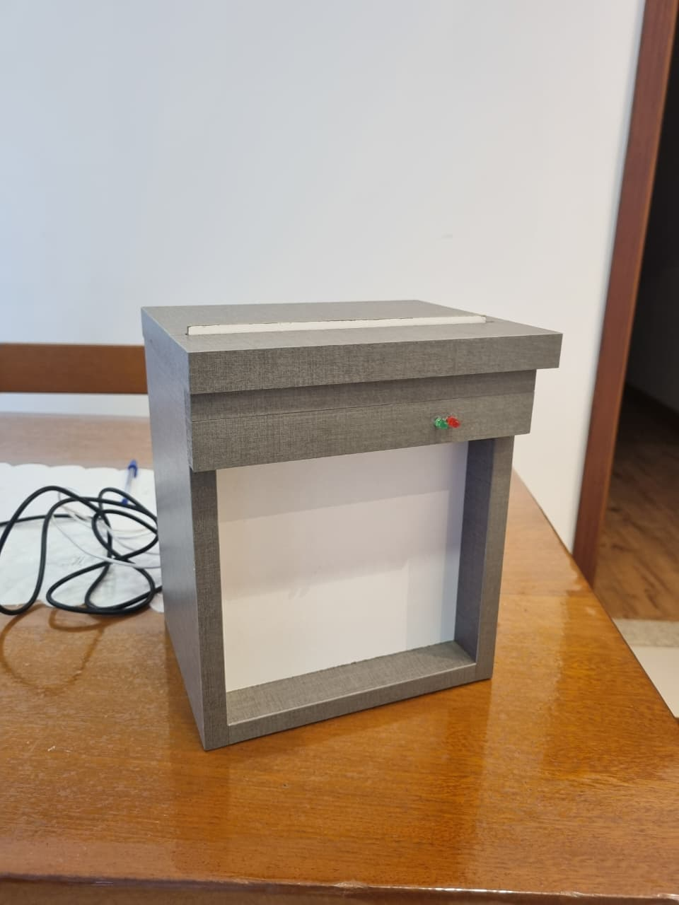
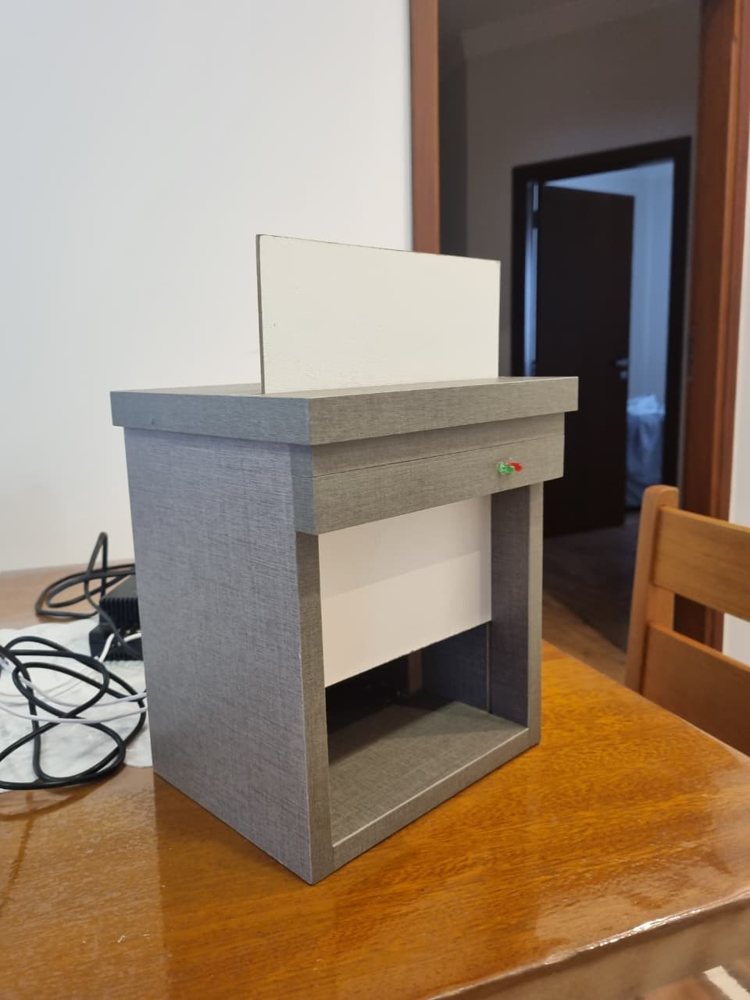
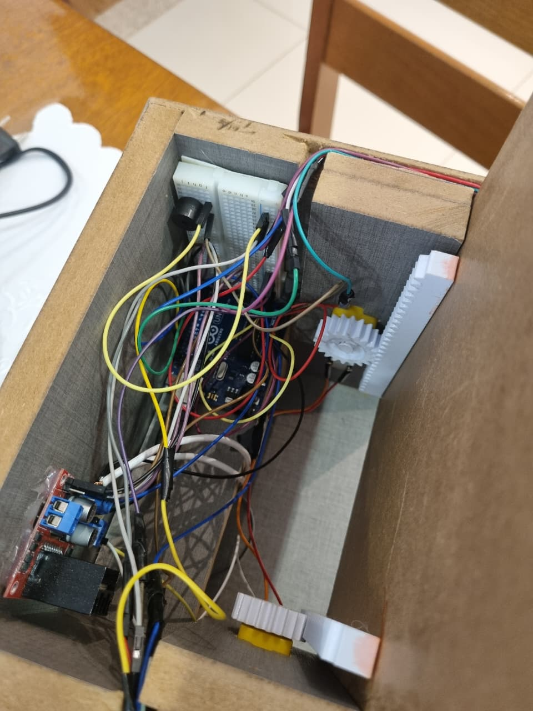
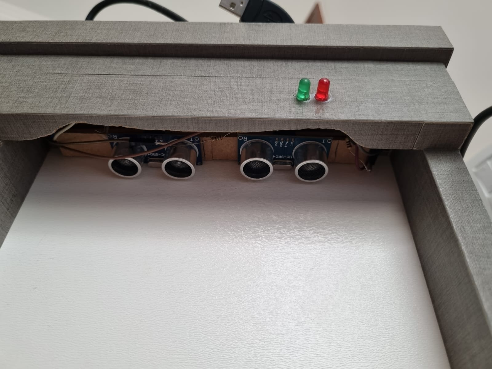
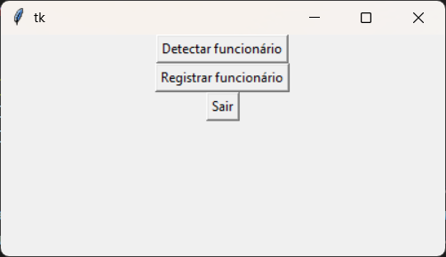
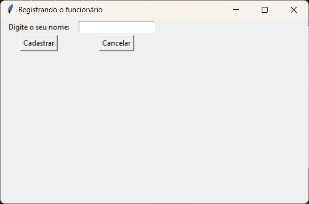

# 📚 Projeto de TCC e Artigo Científico

Bem-vindo(a) ao repositório do meu **Trabalho de Conclusão de Curso (TCC)** e artigo científico.  
Este espaço reúne toda a documentação, código e materiais relacionados ao desenvolvimento.  
Considero o principal projeto que já desenvolvi em equipe!

O professor orientador durante todo esse processo, foi o <a href="https://github.com/douglasbgodoy">Douglas Baptista de Godoy</a>, teve o papel fundamental em ensinar como fazer um TCC e estruturar corretamente toda a documentação e codificação. Agradeço por toda ajuda e conselhos no projeto!

Os alunos que fizeram parte deste TCC, foram: **Leonardo Levi Atílio, Mateus Possari Soares dos Santos e Yuri Matheus Fanti Monteiro.** Cada um teve um papel importante para o desenvolvimento e elaboração para essa proposta.

---

## 🎯 Objetivo do Projeto
As novas tecnologias manufaturadas representam uma evolução significativa no setor industrial, permitindo que as fábricas integrem ferramentas modernas e práticas inovadoras em seus processos produtivos. No entanto, também é essencial considerar os desafios que acompanham essa transformação. Hoje, a marcenaria aproveita uma ampla gama de tecnologias que transformaram a forma como os operários trabalham. Tendo isso em mente, pretendemos criar um conjunto de dispositivos, tais como sensores integrados ao arduíno e câmeras, com o intuito de proteger os funcionários que operam os maquinários selecionados.

---

## 📝 Resumo
O presente projeto propõe a elaboração e implementação de dispositivos inteligentes destinados a elevar a segurança em processos manufaturados, como carpintaria, marcenaria e demais atividades que impliquem riscos operacionais relacionados ao manuseio de maquinário diverso. A arquitetura do sistema baseia-se na integração sinérgica de hardware e software, utilizando a biblioteca OpenCV e a plataforma Arduino. O controle de acesso é executado mediante reconhecimento facial, que verifica a aptidão do operador no cadastro funcional, condicionando a liberação do equipamento. Complementarmente, sensores de proximidade e monitoramento são empregados para mitigar acidentes em zonas críticas, como lâminas, serras e prensas, assegurando a conformidade e a segurança trabalhista no ambiente produtivo.

---

## 🛠️ Tecnologias Utilizadas
- Linguagens de programação: Python e C++.
- Ferramentas: Git/GitHub, Visual Studio Code e Arduino IDE.
- Bibliotecas principais: OpenCV, PySerial e Tkinter.

---

## 📂 Estrutura do Repositório
### Arduino:
- `/ligacaoPyserialArduino/ligacaoPyserialArduino.ino` → Arquivo arduino responsável pela automação e conexão com o Python.
### Python:
- `/ReconhecimentoFacial/assets/img` → Local de armazenamento das imagens capturas com a câmera
- `/ReconhecimentoFacial/main.py` → Arquivo principal do projeto Python.
- `/ReconhecimentoFacial/simple_facerec.py` → Arquivo responsável pelo reconhecimento de faces que estejam cadastradas.
### Imagens, vídeo e PDF:
- `/ResultadosObtidos/img` → Todas as imagens do projeto e interface.
- `/ResultadosObtidos/pdf` → Artigo científico.
- `/ResultadosObtidos/video` → Vídeos de funcionamento.

---

## 📊 Resultados

    
    
    
    
    
    

---

## 🏫 Instituição de ensino
- Curso: Ensino Médio com Habilitação Profissional de Técnico em Desenvolvimento de Sistemas - Mtec-PI
- Instituição: Etec Profª Marinês Teodoro de Freitas Almeida, Novo Horizonte-SP
- Período: 2023 fevereiro - 2025 dezembro

---

## 📖 Artigo Científico
- **Título:** DISPOSITIVOS INTELIGENTES INTEGRADOS COM ARDUÍNO, EM PROL DA SEGURANÇA EM MÁQUINAS E EQUIPAMENTOS
- **Autores:** Leonardo Levi Atílio, Mateus Possari Soares dos Santos e Yuri Matheus Fanti Monteiro
- **Documento PDF:** <a href="./ResultadosObtidos/pdf/Artigo Científico.pdf" target="_blank">Veja o artigo</a>
